# Arrays & Lists: A Simple Explanation

## What is an Array/List?

An **array** (or **list**) is like a row of numbered boxes where you can store things.

Think of it like a train with compartments - each compartment:
- Has a number (index)
- Can hold one item
- Is right next to the others in memory

## Visual Representation


## What Happens When You Declare an Array?

### Step 1: You Write Code

```python
numbers = [10, 20, 30, 40, 50]
```

### Step 2: Computer Allocates Memory


The computer:
1. **Finds free space** in memory (RAM)
2. **Reserves consecutive blocks** - one for each element
3. **Stores the starting address** in your variable name

## Why Index Starts at 0?


Index 0 means: **base address + 0 = first element**

This is why `numbers[0]` gives you the first item!

## Accessing an Element

When you write `numbers[2]`:


This is **instant** (O(1)) because it's just math - no searching needed!

## Array vs List (Language Differences)

| Feature | Array (C, Java) | List (Python) |
|---------|-----------------|---------------|
| Size | Fixed at creation | Can grow/shrink |
| Types | All same type | Can mix types |
| Memory | Contiguous block | May use pointers |

## Memory Layout Comparison

### Static Array (Fixed Size)


### Dynamic List (Can Grow)

```mermaid
graph TD
    subgraph "Python List Internal"
        Header["List Object<br/>length: 4<br/>capacity: 8"]
        Header --> Arr["Pointer Array"]
        Arr --> V1["10"]
        Arr --> V2["20"]
        Arr --> V3["30"]
        Arr --> V4["40"]
        Arr -.-> Empty1["(empty)"]
        Arr -.-> Empty2["(empty)"]
    end
```


Python lists **over-allocate** space so adding items is fast!

## What Happens When You Add an Element?


## Key Takeaways

1. **Arrays are contiguous** - elements sit next to each other in memory
2. **Index = offset** - that's why we start at 0
3. **Fast access** - finding any element is instant (just math)
4. **Fixed vs Dynamic** - some languages let arrays grow, others don't
5. **Trade-offs** - growing arrays requires copying (slow), but accessing is always fast

## Simple Analogy


- The **hotel floor** = your array
- Each **room number** = the index
- Each **guest** = your data
- **Finding Room 102** = instant (just follow the numbers!)
